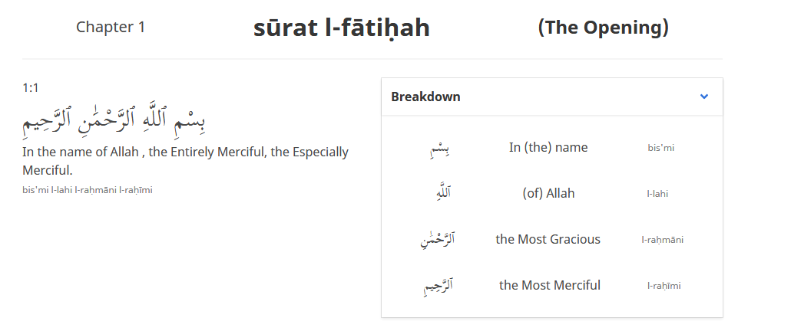

## me on the web
- [bandcamp](https://tesselode.bandcamp.com/)
- [itch](https://tesselode.itch.io/)
- [github](https://github.com/tesselode)
- [youtube](https://www.youtube.com/channel/UCu-Z3vUb-IiVid_l2BWMxTw)
- [twitter](https://twitter.com/tesselode)

## music
<table class='showcase'>
	<tr>
		<td></td>
		<td></td>
	</tr>
</table>

|                                                                               |                          |
| :---------------------------------------------------------------------------- | -----------------------: |
| [beginner spellbook](https://tesselode.bandcamp.com/album/beginner-spellbook) |         witch-themed IDM |
| [make magic](https://tesselode.bandcamp.com/album/make-magic)                 | cozy electronic melodies |
| [another home](https://tesselode.bandcamp.com/album/another-home)             |        dream atmospheres |
| [sharp lines](https://tesselode.bandcamp.com/album/sharp-lines)               |    samples mario kart 64 |

## games

<table class='showcase'>
	<tr>
		<td></td>
		<td></td>
	</tr>
</table>

|                                                                               |                                          |
| :---------------------------------------------------------------------------- | ---------------------------------------: |
| [tera: mind over matter](https://www.lexaloffle.com/bbs/?tid=33170)           |              difficult tetris for pico-8 |
| [web pilot](https://tesselode.itch.io/web-pilot)                              | tempest-inspired tube shooter for pico-8 |
| [netty](https://tesselode.itch.io/netty)                                      |       strategic kinetic action videogame |
| [the tops don't sting you](https://tesselode.itch.io/the-tops-dont-sting-you) |                 cute swimming platformer |

## audio plugins

|                                                      |                                      |
| :--------------------------------------------------- | -----------------------------------: |
| [mika micro](https://tesselode.itch.io/mika-micro)   | simple, expressive subtractive synth |
| [cocoa delay](https://tesselode.itch.io/cocoa-delay) |                   wiggly, cozy delay |
| [flutterbird](https://tesselode.itch.io/flutterbird) |    easy pitch and volume fluctuation |

## libraries for löve

|                                                           |                                             |
| :-------------------------------------------------------- | ------------------------------------------: |
| [baton](https://github.com/tesselode/baton)               |   quick and seamless keyboard/gamepad input |
| [cartographer](https://github.com/tesselode/cartographer) |        simple tiled map loading and drawing |
| [ripple](https://github.com/tesselode/ripple)             |          audio manager with tagging support |
| [nata](https://github.com/tesselode/nata)                 | entity management with optional ECS support |

## collaborations

|                                           |                                      |
| :---------------------------------------- | -----------------------------------: |
| [qur'analytics](http://quranalytics.org/) | UI refresh design and implementation |

## thoughts
- [game design manifesto](thoughts/manifesto)
- [colossus design doc](thoughts/colossus)
